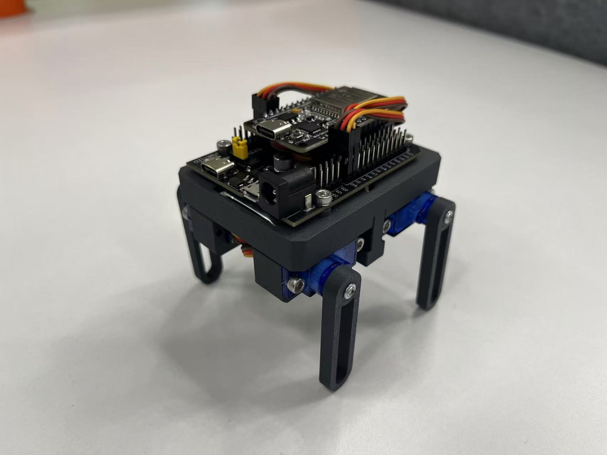
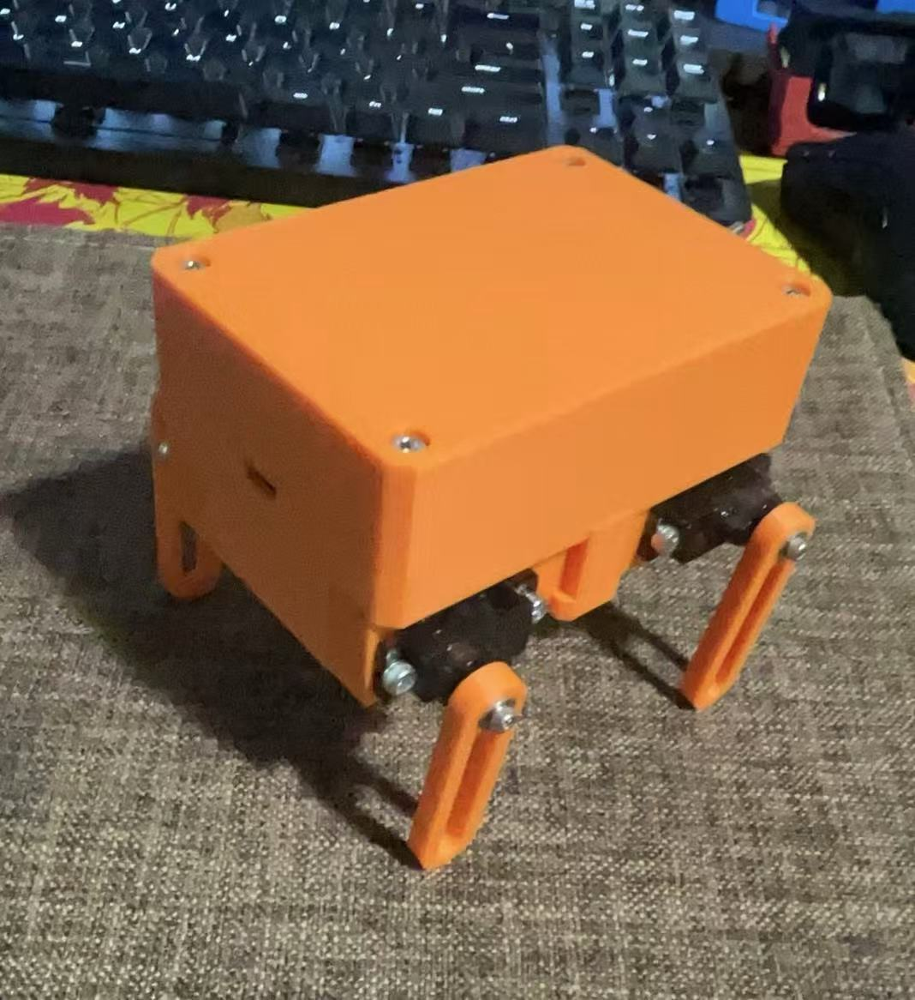
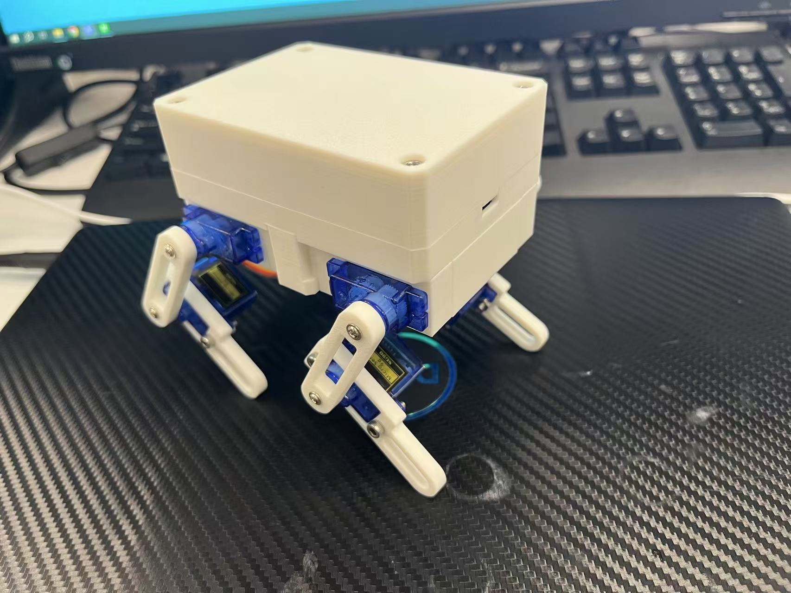
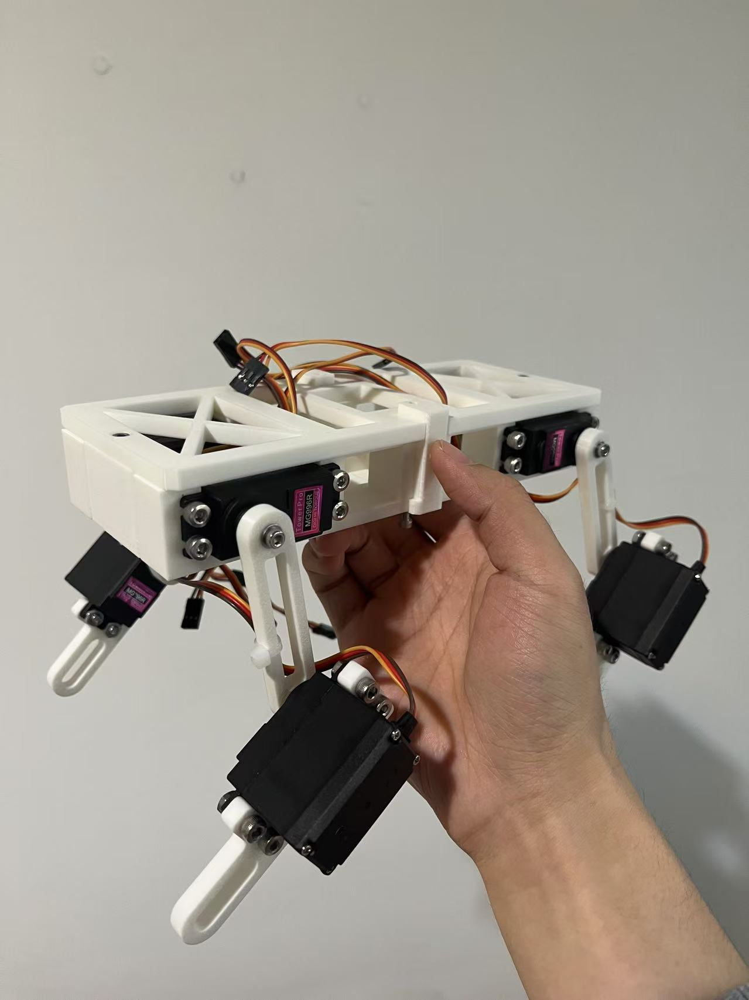
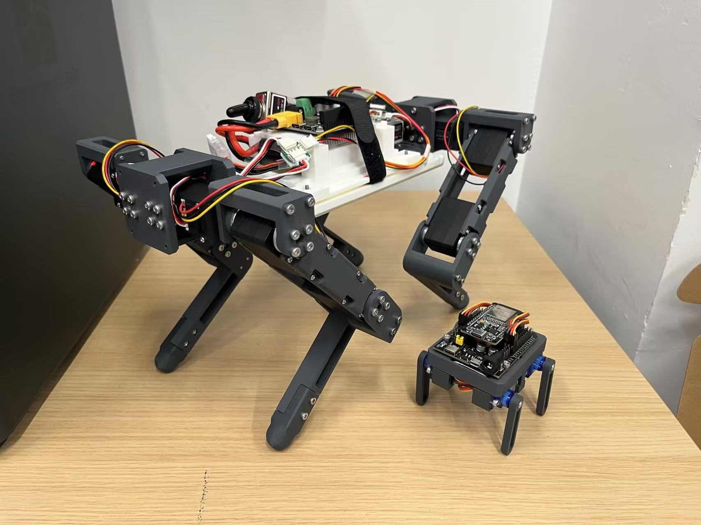

# servo dog

- A low-cost, ESP32-based robotic dog with 4/8/12-DOF configurations.

- All files are open-source but not yet fully organized. Email me if you're highly interested and need them urgently.

